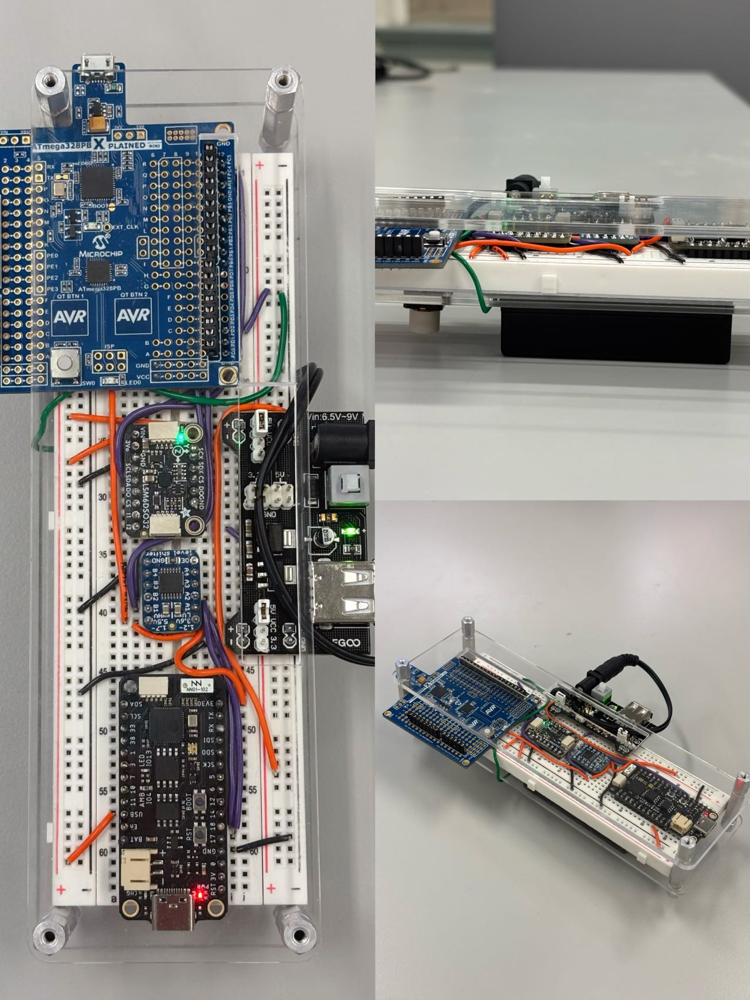
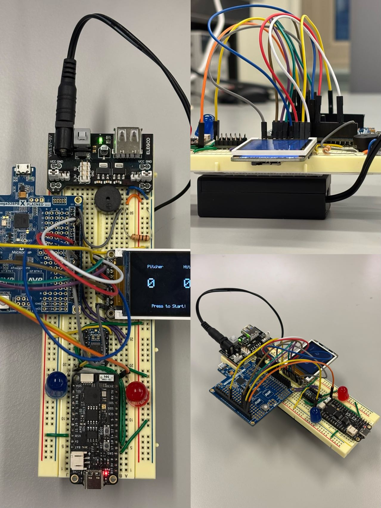
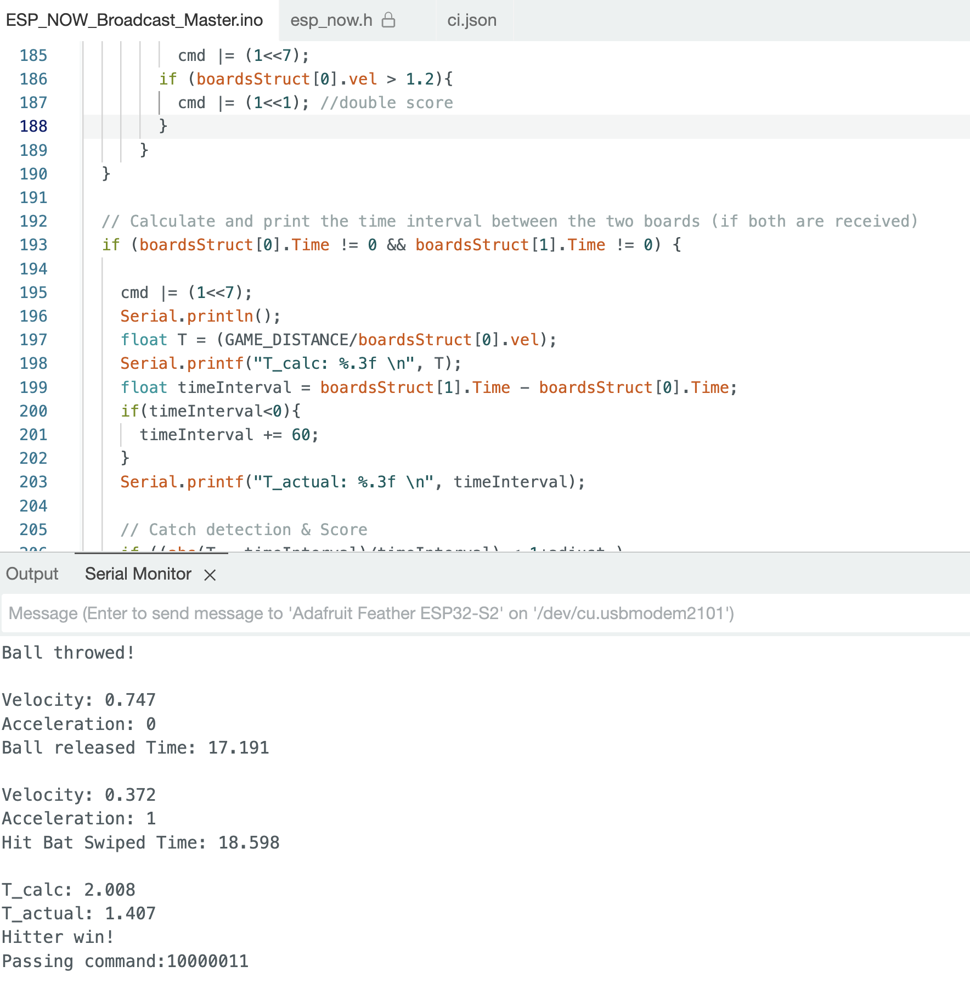
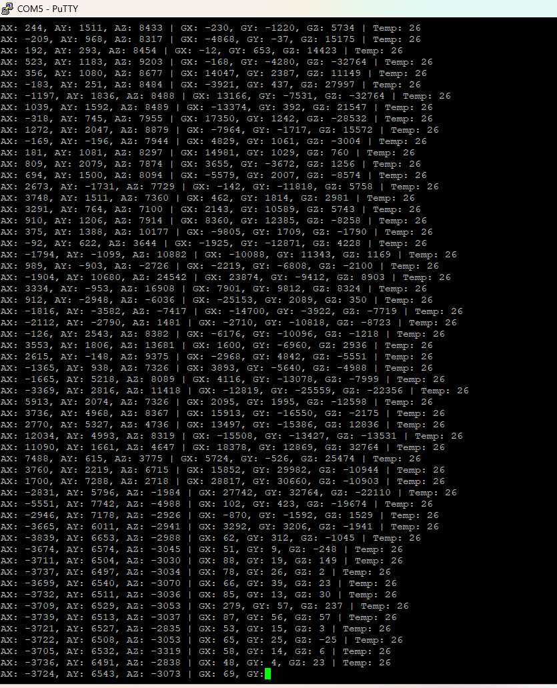

# Developed by Crazy Thursday

- Team Name: Crazy Thursday
- Team Members: Zheyu Li, Shun Yao, Zhuozi Xie
- Github Repository URL: [https://github.com/upenn-embedded/final-project-crazy-thursday.git](https://github.com/upenn-embedded/final-project-crazy-thursday.git)
- Github Pages Website URL: [https://ssysy.github.io/crazythursday.github.io/](https://ssysy.github.io/crazythursday.github.io/)
- Description of hardware: ATmega328PB, ESP32 S2 Feather, 6-DOF IMU, LCD, LED, Buzzer

## Introduction

Swingtronics is a **motion sensing game controller** that can be held in one hand. By detecting the player's movement as an input, it is converted into a digital signal and transmitted wirelessly to a portable processor. All devices are **portable** and **do not require WiFi**. Just have batteries ready to play in **indoor/outdoor environments**!

Minimum of just one game controller and one portable processor to play the game (Multiplayer/multi-input device is also supported). Currently, a baseball simulation game has been developed, which requires 2 players with 1 processor. More game (tree-cutting, sword battle etc.) is on the way!

### 1. Video

[Click Here for Our Final Demo Video!](https://youtu.be/q_Dpyx5knPU)

Here are two videos for our [Indoor Stability Test](https://youtu.be/DEhBPQdpUdI) and [Outdoor Stability Test](https://youtu.be/DEhBPQdpUdI).

### 2. Images

#### Game Controller 1 (Input Device/Pitcher)

#### Game Controller 2 (Input Device/Hit Bat)

#### Portable Central Processor (Output Device/Score Board)

### 3. Results

- General Purpose Devices: 2 motion-sensing game controller and 1 central processor, all devices are portable and no WiFi requirement.

- Available Game: A baseball simulation game, which requires 2 game controller (one as pitcher and another as hit bat) and 1 processor (perform as scoreboard), allowing 2 players to enjoy. The game can be played at low latency in both indoor and outdoor environments with a player distance within 10m.
  
### 4. Software Requirements Specification (SRS) Validation

- SRS 01 – Two microcontroller needs to be able to communicate with each other without external WiFi connection. Communication delay should be less than 10ms. In our project, ESP32 device communicates directly with another ESP32 by specifying its MAC address.
  
   [Proof of Work Video](https://youtube.com/shorts/MFv3rUwa7cc)

- SRS 02 – Mutiple MCU devices required to be able to identify others, allowing one Master device able to communicate with mutiple slave diveces. This project use ESP32 MAC addresses to identify specific peers, allowing a single device to receive data from multiple others.

  [Proof of Work Video](https://youtube.com/shorts/MFv3rUwa7cc)

- SRS 03 - The Master MCU device needs to be able to generate a appropriate animation or score board on an LCD or equivlent display based on the signal send from slave devices.

  [Proof of Work Video](https://youtu.be/N9RdOPIz6gk)

- SRS 04 - With the acceleration on X and Y axis of IMU, one calculation algorithm that can calculate the trajectory and timing slot between the Pither and HitBall needs to be programmed.

  

- SRS 05 - The timing and predicted trajectory are used to determine which player win points, also the gaming logic will be programmed within one project.

  [Proof of Work Video](https://youtu.be/N9RdOPIz6gk)

### 5. Hardware Requirements Specification (HRS) Validation

- HRS 01 – Microcontroller with enough communication ports to establish at least three communicaiton channels. This project is based on ATmega328PB microcontroller coded with baremetal C.
  
  [Please See File:"GameController_ATmega.X" for Proof](https://github.com/ssysy/crazythursday.github.io/tree/main)

- HRS 02 - Microcontroller with WiFi communication ability or equivlent. Here wireless communication parts will be handelled by ESP32 S2 Feather through ESP-NOW protocol.

  [Proof of Work Video](https://youtube.com/shorts/MFv3rUwa7cc)

- HRS 03 – A 6-DOF orientation IMU shall be used for movement detection. The sensor shall measure acceleration and angular velocity on the Pitcher Glove and the Hit Bat, with a detection range of at least -4g to 4g and a resolution of 2^16 steps.

  

- HRS 04 – An LCD used for user interface. The display shall be able to communicate with the microcontroller via UART, I2C or equivalent communication protocol.

  [Proof of Work Video](https://youtu.be/N9RdOPIz6gk)

- HRS 05 - A power supply that can provide rated power for the used mircocontrollers, in this case: 3.3V for ESP32 S2 Feather and 5V for ATmega328PB. (Since we are using ATmega and ESP32 that have different logic voltage levels, an additionaly level shifter is need for communication between the two)

  [Please See File:"datasheet" for Proof](https://github.com/ssysy/crazythursday.github.io/tree/main)

- HRS 06 - One push button (momentary switch) shall be used at the Pitcher Glove to detect whether the 'ball' has been thrown out or not.

  [Please See File:"datasheet" for Proof](https://github.com/ssysy/crazythursday.github.io/tree/main)

- HRS 07 - Actuators: LED, Buzzer, etc. could be added to any socre board devices as player interfaces. This project used two LEDs and one buzzer on socre board.

  [Proof of Work Video](https://youtu.be/N9RdOPIz6gk)

### 6. Conclusion

### What we learned

- Based on chip's datasheet to write bare metal C
- Application of Timer, interrupt, GPIO on AVR (ATmega328PB)
- Learn how to write drivers for I2C, UART, SPI on AVR chips
- ESP-NOW configuration on ESP32 using Arduino

### Encountered Issues

- High Complexity of calculating velocity and angle (Kalman filtering and quaternions can be used to improve detection accuracy)
- Short Battery life (Final demo: Playable for only 10-15 mins per battery cycle)
- Conflicts caused by multiplexing of communication protocol pin (UART1 and SPI0, we therefore change to SPI1)
- Integration of different parts could be difficult (3 devices, 4 different kind of communication protocols)
- Game logics can be complicated and cause some bugs.

### Next steps

- More Reliable, Longer Lasting, Rechargeable Power Supply Solutions
- Better visualization (Larger LCD etc.)
- More Robust Hardware Connection (PCB, More fitted cases)
- More Available Games
