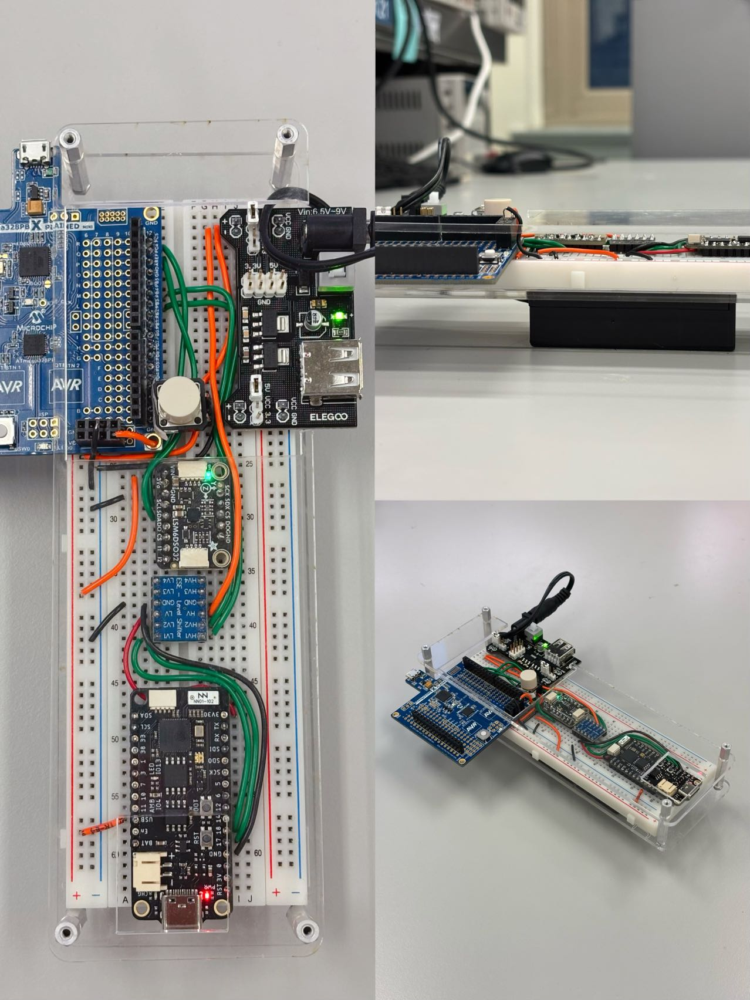

# Developed by Crazy Thursday

- Team Name: Crazy Thursday
- Team Members: Zheyu Li, Shun Yao, Zhuozi Xie
- Github Repository URL: https://github.com/upenn-embedded/final-project-crazy-thursday.git
- Github Pages Website URL: https://github.com/ssysy/crazythursday.github.io
- Description of hardware: ATmega328PB, ESP32 S2 Feather, 6-DOF IMU, LCD, LED, Buzzer

## Introduction

Swingtronics is a **motion sensing game controller** that can be held in one hand. By detecting the player's movement as an input, it is converted into a digital signal and transmitted wirelessly to a portable processor. All devices are **portable** and **do not require WiFi**. Just have batteries ready to play in **indoor/outdoor environments**!

Minimum of just one game controller and one portable processor to play the game (Multiplayer/multi-input device is also supported). Currently, a baseball simulation game has been developed, which requires 2 players with 1 processor. More game (tree-cutting, sword battle etc.) is on the way!

### 1. Video

[Youtube Demo Video](https://www.youtube.com/watch?v=_IhdffkUVsc)

### 2. Images

#### Game controller 1 (Input device/Pitcher)

#### Game controller 2 (Input device/Hit Bat)

#### Portable Central Processor

### 3. Results

What were your results? Namely, what was the final solution/design to your problem?

### 4 Software Requirements Specification (SRS) Validation

Based on your quantified system performance, comment on how you achieved or fell short of your expected software requirements. You should be quantifying this, using measurement tools to collect data.

SRS 01 – In a single peer-to-peer setup, ESP device communicates directly with another ESP device by specifying its MAC address.

SRS 02 – Devices use MAC addresses to identify specific peers, allowing a single device to send data to multiple others, either as broadcast or to specific groups.

SRS 03 - Upon the signal send to computer, the system will generate the appropriate animation: bat swing, followed by the ball landing or catched animation.

Due to the limitaion of LCD, instead of ball landing or cathed animation we developed a show each stage with words on the screen with a ball flying animation.

SRS 04 - With the xyz acceleration and spatial angle acquired by the sensor, the trajectory and landing position of the baseball are calculated, and the result is judged by comparing the swing time and catch time.

### 5 Hardware Requirements Specification (HRS) Validation

HRS 01 – Microcontroller with enough communication ports to establish at least three communicaiton channels. This project is based on ATmega328PB microcontroller coded with baremetal C.

HRS 02 - Microcontroller with WiFi communication ability or equivlent. Here wireless communication parts will be handelled by ESP32 S2 Feather through ESP-NOW protocol.

HRS 06 - One push button (momentary switch) shall be used at the Pitcher Glove to detect whether the 'ball' has been thrown out or not.

Modification & Improvement:

HRS 03 – A 6-DOF orientation IMU shall be used for movement detection. The sensor shall measure acceleration and angular velocity on the Pitcher Glove and the Hit Bat, with a detection range of at least -4g to 4g and a resolution of $2^{16}$ steps.

HRS 04 – An LCD used for user interface. The display shall be able to communicate with the microcontroller via UART, I2C or equivalent communication protocol.

HRS 05 - A power supply that can provide rated power for the used mircocontrollers, in this case: 3.3V for ESP32 S2 Feather and 5V for ATmega328PB.

### 4. Conclusion

Reflect on your project. Some questions to consider: What did you learn from it? What went well? What accomplishments are you proud of? What did you learn/gain from this experience? Did you have to change your approach? What could have been done differently? Did you encounter obstacles that you didn’t anticipate? What could be a next step for this project?
